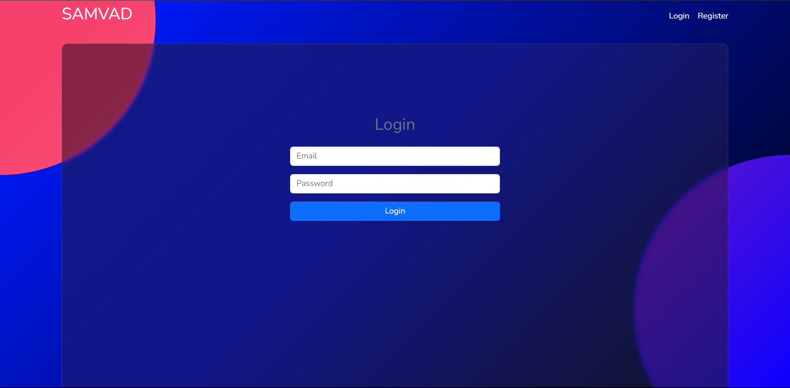

# React + Vite

This is the client application of Samvad - A Chat App built with React + Vite.

## Features 
1. Real-time messaging using socket-io.

2. Sending notifications if user is not online or chatting to other person.
3. Showing green dot if users is online.

4. Users can close the chat using close option given below the messages.
5. Users can login/register if they are not logged in or a registered user.

6. Users can search other users to start chat with the search option given and by clicking on the user name it will add the user to the chat section.


## Install Vite
```
npm create vite@latest
```

## Select variant JavaScript and install dependencies
```
npm install
```

## Run and Production Build
```
npm run dev
npm run build
```

